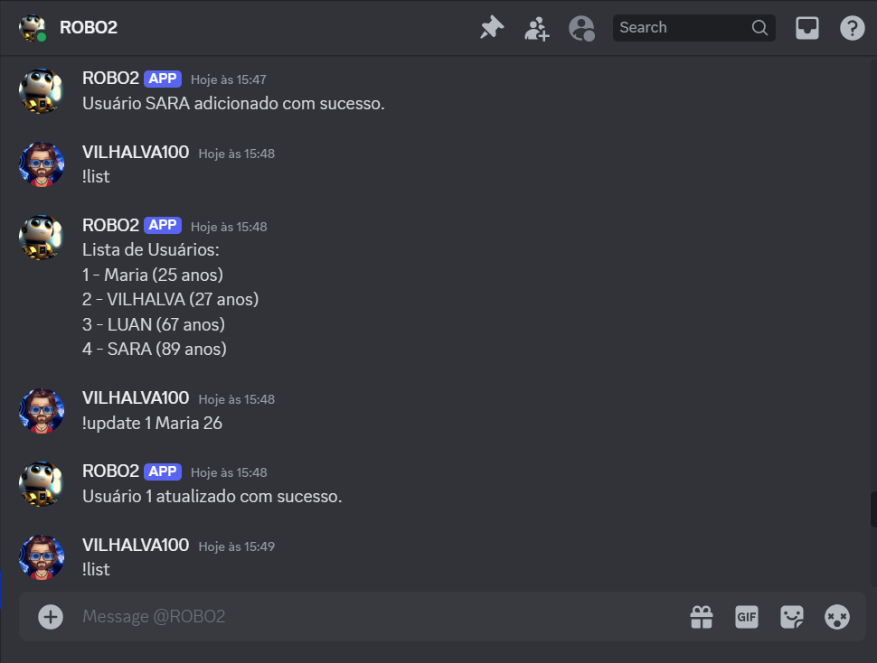
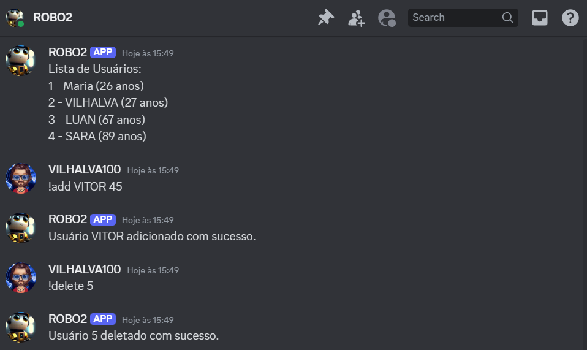
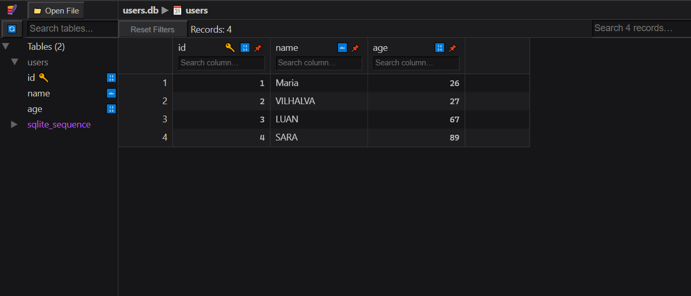

# CRUD COM DISCORDPY 
🤖ESTE É UM BOT DO DISCORD FEITO COM DISCORDPY DE CRUD DE NOMES E IDADES COM SQLITE.

 <br>
 <br>
 <br>
 <br>

## DESCRIÇÃO:
O bot desenvolvido em Discord.py é um CRUD (Create, Read, Update, Delete) simples utilizando um banco de dados SQLite integrado. Ele permite gerenciar uma lista de usuários diretamente no servidor Discord através de comandos específicos.

## FUNCIONALIDADES:
1. **Adicionar Usuário (`!add`)**:
   - Permite adicionar um novo usuário ao banco de dados especificando o nome e a idade.
   - **Uso**: `!add <nome> <idade>`

2. **Listar Usuários (`!list`)**:
   - Lista todos os usuários atualmente cadastrados no banco de dados.
   - **Uso**: `!list`

3. **Atualizar Usuário (`!update`)**:
   - Atualiza as informações de um usuário existente pelo ID, modificando o nome e a idade.
   - **Uso**: `!update <id> <nome> <idade>`

4. **Deletar Usuário (`!delete`)**:
   - Remove um usuário do banco de dados com base no ID.
   - **Uso**: `!delete <id>`

## EXECUTANDO O PROJETO:
1. **Editar o código:**
   - Certifique-se de substituir `seu_token_aqui` pelas informações corretas das suas credenciais em `CODIGO/TOKEN.py`.

2. **Instalando as dependências:**
   - Antes de executar o aplicativo, certifique-se de instalar todas as dependências necessárias. No terminal, execute o seguinte comando para instalar as dependências listadas no arquivo `requirements.txt` no diretório: `CODIGO`:
   ```bash
   pip install -r requirements.txt
   ```
   - Isso instruirá o pip a ler o arquivo requirements.txt e instalar todas as dependências listadas.

3. **Inicie o Bot:**
   - Execute o bot do Discord iniciando-o com o seguinte comando no diretório `CODIGO`:
    ```bash
    python CODIGO.py
    ```

4. **Comandos Disponíveis**:
   - Use os seguintes comandos no canal de texto onde o bot está ativo:

     - **Adicionar Usuário**: `!add <nome> <idade>`
       - Exemplo: `!add Maria 25`

     - **Listar Usuários**: `!list`
       - Exibe todos os usuários cadastrados no banco de dados.

     - **Atualizar Usuário**: `!update <id> <nome> <idade>`
       - Exemplo: `!update 1 Maria 26`

     - **Deletar Usuário**: `!delete <id>`
       - Exemplo: `!delete 1`

5. **Observações**:
   - Certifique-se de que o bot está online no Discord para responder aos comandos. Verifique a saída no console Python para garantir que o bot esteja conectado.
   - Os comandos funcionam conforme definido no script Python. Qualquer modificação nos comandos ou na estrutura do banco de dados deve ser feita diretamente no código.

## EXEMPLOS DE COMANDOS:
Suponha que você tenha adicionado o bot ao seu servidor Discord e ele esteja online. Aqui está como você pode usar os comandos:

1. Para adicionar um usuário:
   ```
   !add Maria 25
   ```
   Isso adicionará um usuário chamado Maria, com 25 anos, ao banco de dados.

2. Para listar todos os usuários:
   ```
   !list
   ```
   Isso mostrará uma lista de todos os usuários atualmente registrados no banco de dados.

3. Para atualizar um usuário existente (por exemplo, o usuário com ID 1):
   ```
   !update 1 Maria 26
   ```
   Isso atualizará as informações do usuário com ID 1 para o nome Maria e idade 26.

4. Para deletar um usuário pelo ID (por exemplo, o usuário com ID 1):
   ```
   !delete 1
   ```
   Isso deletará o usuário com ID 1 do banco de dados.

Esses são exemplos básicos de como você pode interagir com o bot. Você pode expandir e personalizar os comandos conforme necessário, adicionando mais funcionalidades ou ajustando os parâmetros de entrada e saída conforme a lógica do seu aplicativo Discord.

## NÃO SABE?
- Entendemos que para manipular arquivos em muitas linguagens e tecnologias relacionadas, é necessário possuir conhecimento nessas áreas. Para auxiliar nesse aprendizado, oferecemos cursos gratuitos disponíveis:
* [CURSO DE DISCORDPY](https://github.com/VILHALVA/CURSO-DE-DISCORDPY)
* [CURSO DE PYTHON](https://github.com/VILHALVA/CURSO-DE-PYTHON)
* [CURSO DE SQLITE](https://github.com/VILHALVA/CURSO-DE-SQLITE)
* [CONFIRA MAIS CURSOS](https://github.com/VILHALVA?tab=repositories&q=+topic:CURSO)

## CREDITOS:
- [PROJETO CRIADO PELO VILHALVA](https://github.com/VILHALVA)

